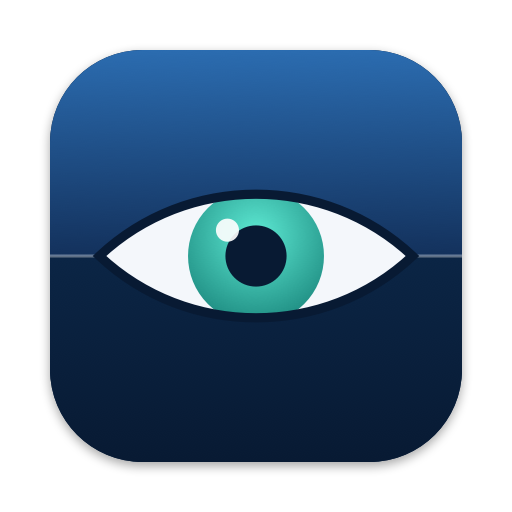

<p align="center">
  
</p>

<h1 align="center">Viji</h1>

<p align="center"><b>See every menu bar icon — even the ones hidden behind the notch.</b></p>

<p align="center">
  <a href="https://github.com/dalex160/Viji/releases/latest"></a>
  
  <a href="LICENSE"></a>
</p>

On MacBooks with a camera notch, menu bar icons that don't fit simply disappear behind it. Viji adds a single eye to your menu bar. Click it and the eye opens onto a list of **every** menu bar icon; click any entry to open that icon's menu as if you had clicked it directly.

*Viji* is the phonetic spelling of *vigie*, French for the lookout at the top of the mast who sees beyond the horizon.

## Features

- **One click, everything listed**: every status item from every app, with its app icon and name, in menu bar order.
- **Opens the real menu**: picking an entry triggers the original icon, even when it is hidden by the notch.
- **Your order**: drag entries into the order you want, hide the ones you never use, or sync back to the menu bar order.
- **Lightweight**: a single Swift file, no dependencies, no network access, no analytics.
- **Open at login** toggle, English and French interface.

## Install

### One-line install (recommended)

```sh
curl -fsSL https://raw.githubusercontent.com/dalex160/Viji/main/install.sh | zsh
```

This downloads the source and builds it on your Mac with Apple's Command Line Tools (the script offers to install them if needed). Because the app is built locally, macOS doesn't block it.

### Prebuilt app

Download `Viji.zip` from the [latest release](https://github.com/dalex160/Viji/releases/latest), unzip it and move `Viji.app` to `/Applications`.

The app is not notarized, so macOS will refuse to open it the first time. Either go to **System Settings → Privacy & Security** and click **Open Anyway**, or run:

```sh
xattr -dr com.apple.quarantine /Applications/Viji.app
```

### Build from source

```sh
git clone https://github.com/dalex160/Viji.git
cd Viji
./build.sh
```

`build.sh` compiles, installs to `~/Applications` and launches Viji. `UNIVERSAL=1` builds for both Apple silicon and Intel, and `INSTALL=0` only builds into `./build`.

## First launch

1. **Grant Accessibility access** when macOS asks (System Settings → Privacy & Security → Accessibility). Viji needs it to read and click other apps' menu bar icons.
2. **Move the eye**: macOS places new icons on the left, which is exactly where the notch hides them. Hold ⌘ and drag the eye next to the battery or Wi-Fi icon; its position is remembered.

> Every rebuild changes the app's ad-hoc signature, so macOS asks for Accessibility access again after an update. `build.sh` resets the old permission entry for you.

## Usage

| Action | How |
| --- | --- |
| See all icons | Click the eye |
| Open an icon's menu | Click its entry in the list |
| Reorder or hide entries | **Edit order…** (⌘,), then drag rows or uncheck **Show** |
| Restore menu bar order | **Sync with menu bar** in the order window |

## How it works

Viji uses the macOS Accessibility API to read each running app's `AXExtrasMenuBar`, the element that holds its menu bar icons, and performs `AXPress` on the one you pick. It skips Control Center's unused 0×0 placeholders and remembers which apps own icons so the list opens instantly.

## Limitations

- An icon's menu or panel opens where macOS placed that icon. For icons hidden behind the notch, that can be at the far left of the screen.
- Viji reorders its own list, not the real menu bar. macOS has no public API for moving other apps' icons.
- Tested on macOS 26 (Tahoe), Apple silicon.

## License

[MIT](LICENSE)
